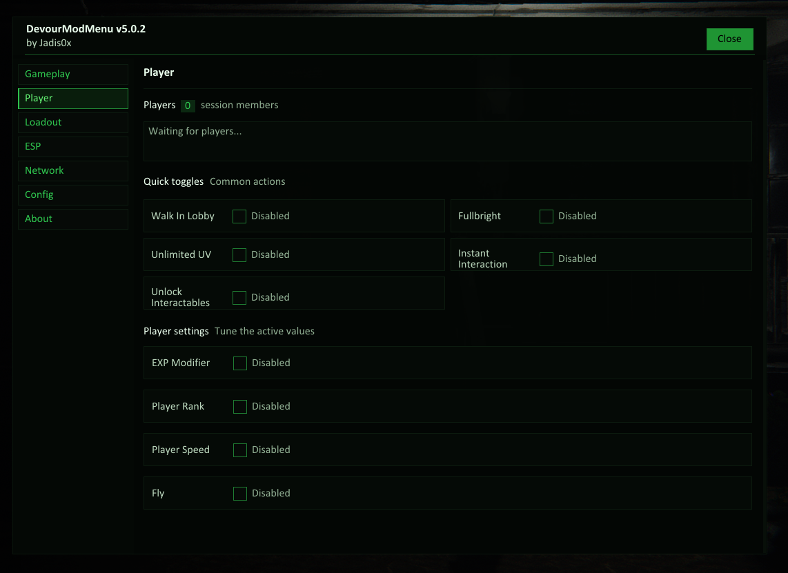

  

<h1 align="center">DevourModMenu</h1>

Ultimate mod menu for DEVOUR.

## Access

DevourModMenu is a private project. The source code is not distributed.

Mod access is activated for users who support the project. Please contact me on Discord **before making any payment** so I can provide the current access and installation details.

Discord: `Jadis0x`

## Requirements

- Windows 10/11 (64-bit)
- A legitimate Steam copy of DEVOUR
- Microsoft Visual C++ Redistributable (x64)

## Installation

1. Download and install the Westwest `.exe` from its GitHub Releases page, then launch Westwest.
2. If Westwest asks for device approval, send me the displayed device code on Discord (`Jadis0x`). I will approve your device; try again after I confirm.
3. Select **DevourModMenu** in Westwest. It will try to locate your DEVOUR installation in your Steam libraries. If it cannot find it, click **CHOOSE ROOT** and select the folder containing `DEVOUR.exe`.
4. Click **VERIFY & INSTALL**. Westwest verifies the release and installs it under the game's `Mods` folder. Use **INSTALL UPDATE** for later releases.
5. Launch DEVOUR through Steam.

Use Westwest to update or uninstall the mod. Do not manually copy, rename, or modify its installed files. If the menu does not appear, contact me on Discord before reinstalling anything.

## Features

- Walk In Lobby
- Fullbright
- UV Light
- Instant Interaction
- Unlock Interactables
- EXP Modifier
- Player Rank Modifier
- Player Speed Modifier
- Fly
- Kill Player
- Revive Player
- Jumpscare Player
- Teleport Player
- Azazel Manual Control
- Azazel Speed Modifier
- Prefab Spawner
- Map Progress Control
- Player ESP
- Azazel ESP
- Collectable ESP
- Steam ID Modifier
- Steam Persona Name Modifier
- Room Name Override
- Force Public Room
- Lobby Size Modifier
- Outfit Selector
- Carry Item

Feature availability may vary by game version and authorized build.

## Support

For access, payment questions, installation help, or compatibility issues, message `Jadis0x` on Discord.

## Disclaimer

DevourModMenu is intended for private modding, development, and research purposes. You are responsible for how you use the software.
